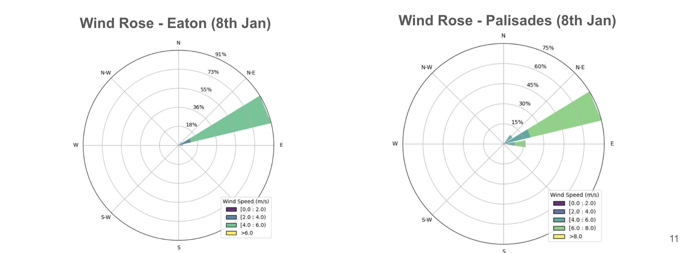

# WILDFIRE - Wildfire Impacts on Local Dynamics: Forests, Income, Residents, and Environment
Team members: Joyce Tongxin Cai, Yogerej Visvanathan, Kwame Donkor 

## Abstract

Wildfires are becoming increasingly severe due to climate change and land-use patterns, posing serious risks to both ecosystems and communities. This study examines the **January 2025 Palisades and Eaton wildfires** in Los Angeles County, analyzing fire behavior, environmental drivers, and socioeconomic impacts using multi-source data.  

### Key Findings:  

- **<u>Fire Behavior & Environmental Drivers</u>:** The wildfire spread was **driven primarily by strong northeast winds**. **Dry vegetation**, fueled by **past wet winters**, contributed to rapid fire growth.  

- **<u>Fire Intensity & Structure Damage</u>:** Fire Radiative Power (FRP) analysis showed significant fire intensity over time. **64% of homes in Palisades** and **51% in Eaton** were **destroyed**. Structural damage was **disproportionately higher** in census tracts with **high-income and elderly populations**.  

- **<u>Air Quality Impact</u>:** The wildfire caused a **sharp increase in PM2.5 concentrations**, leading to **hazardous air quality conditions**.  

- **<u>Vegetation Loss & Recovery Potential</u>:** **Nearly 100% of burned regions had no regrowth potential**, based on **Normalized Burn Ratio Index (NBRI)** analysis.  

- **<u>Broader Implications</u>:**  Wildfire intensity, **atmospheric conditions, air pollution, and social vulnerability** are closely linked. Findings highlight the need for **improved wildfire forecasting models** and **targeted community resilience planning** to mitigate future risks.  

## Introduction

Wildfires are becoming more frequent and intense due to climate change and land-use patterns, posing serious risks to both ecosystems and human communities.  

In January 2025, the **Palisades and Eaton wildfires** in Los Angeles County collectively burned over 57,000 acres, resulting in 29 fatalities and the destruction of more than 18,000 structures. The impacts of these fires varied across different socioeconomic groups, highlighting disparities in vulnerability and resilience.  

This study analyzes the environmental and atmospheric conditions that influenced wildfire spread, with a focus on fire radiative power (FRP) data from MODIS (1-km) and VIIRS (375-m) satellites. We examine temperature patterns using ERA5 reanalysis data, alongside wind speeds, precipitation, and vegetation density, to assess their roles in fire intensity. Additionally, we evaluate the impact of wildfires on air quality and vulnerable communities by integrating land use, census tract-level socioeconomic indicators, and structure damage assessments. By understanding the relationships between atmospheric conditions, social vulnerability, and wildfire damage, this research will shed light on future mitigation strategies to reduce wildfire risks.

### Research Questions  
- What were the primary environmental factors driving the 2025 Palisades and Eaton wildfires?
- How did these wildfires impact structure damage, vegetation, air quality, and socioeconomic communities? 

*Figure 1: 2025 January Wildfire in Los Angeles County. Source: [Penitentes in Wikipedia](https://en.m.wikipedia.org/wiki/File:January_2025_Southern_California_wildfires_map.png).*

## Datasets

* **Geospatial Boundaries (Vector):** Los Angeles County administrative boundary shapefiles. Source: [La Census Tract Shapefiles](https://redistricting.lacounty.gov/mapping-files-data-download/)
* **Fire Incident Data (Vector):** Wildfire burn perimeters, Fire progression data (FRP - Fire Radiative Power), Structure damage and destruction levels (DINS). Sources: [CAL FIRE](https://www.fire.ca.gov/), [NASA FIRMS](https://firms.modaps.eosdis.nasa.gov/)
* **Vegetation Data (Raster):** Vegetation index, moisture index, burned ratio index with 5-days temporal resolution and 10m-20m spatial resolution. Sources: Sentinel-2 NDVI, NDMI, MSI, EVI, SAVI, GCI and NBRI ([Accessed using Microsoft's Planetary Computer platform](https://planetarycomputer.microsoft.com/dataset/sentinel-2-l2a#overview)).
* **Socioeconomic Data (Vector):** Social Vulnerability, Census tract-level demographics. Sources: [Social Vulnerability Index](https://www.atsdr.cdc.gov/place-health/php/svi/index.html)
* **Climate & Land Cover Data (Raster):** Temperature, Precipitation, Humidity, Wind speed & direction. Sources: [ERA5 Land Hourly Reanalysis Data](https://cds.climate.copernicus.eu/datasets/reanalysis-era5-land?tab=overview), [ESA World Cover](https://worldcover2021.esa.int/) 
* **Air Quality Data (Tabular):** Daily air pollutant concentrations including PM2.5, PM10, NO2, SO2, CO and O3; Computation of Air Quality Index (AQI) based on concentrations of air pollutants. Sources: [World Air Quality Index](https://aqicn.org/contact/) and [United States Environmental Protection Agency](https://www.epa.gov/aboutepa) 

### Python Packages Used 
- **Geospatial Data Handling & Analysis:** `geopandas`, `shapely`, `rioxarray`, `xarray`
- **Climate & Environmental Data Processing:** `pyproj`
- **Data Science & Statistical Analysis:** `numpy`, `pandas`, `scipy`, `metpy`
- **Visualization & Mapping:** `matplotlib`, `matplotlib.dates`, `cartopy`, `seaborn`, `Folium`, `plotly`, `plotly.express`, `plotly.graph_objects`, `kaleido`, `contextily`, `windrose`
- **Remote Sensing & Fire Data:** `rasterio`, `odc.stac`, `pystac_client`, `planetary_computer`
- **Air Quality & Environmental Analysis:** `ozon3`

## Methodology
- Data Processing (Formatting & Cleaning): Convert all datasets to EPSG 32611 - WGS 84 / UTM zone 11N.
- **Fire Intensity Analysis** *(located in `/Fire_Incident_Analysis/`)*
  - Integrated fire radiative power (FRP) data from five satellite sources and resampled them to a daily scale for each region.  
  - Computed fire intensity based on pixel size to analyze fire spread and derived the time series of total daily radiative power.  
  - Generated a correlation heatmap to assess relationships between fire radiative power, temperature, wind speed, precipitation, and humidity, identifying key driving factors.  
  - Analyzed the correlation between fire radiative power and air pollutant concentrations (PM2.5 and PM10) to evaluate the fire’s impact on air quality.  
- **Fire Structure Analysis** *(located in `/Fire_Incident_Analysis/`)*
  - Assessed the distribution of structural damage across different damage levels.  
  - Examined damage patterns within census tracts to identify spatial variations in fire impact.  
- **Land Use Land Cover (LULC) Analysis** *(located in `/LULC_ERA5_Land/`)*
  - Overlay fire perimeter on LULC plot of Study Area and compute the areas of Built & Tree/Shrub/Grass Cover were affected by the fires.
- **Vegetation Density Analysis**
  - Investigated vegetation density using vegetation, moisture and burned ratio indices.
  - Created mask to remove cloud cover pixels using SCL from Sentinel-2
  - Calculated delta NBRI from the difference between pre-fire NBRI and post-fire NBRI to determine vegetation regrowth potential in the area of study.
- **Air Quality Analysis**
  - Investigated air pollutant concentrations during wildfire and throughout January 2025 from the World Air Quality Index database and US EPA.
  - Calculated Air Quality Index (AQI) based on the concentration of air pollutants. 
- **Weather Variable Analysis** *(located in `/LULC_ERA5_Land/`)*
  - Investigate short & long-term (one-year) trends of weather variables in dataset (Temperature, Wind, Precipitation) and the calculated ones (Specific Humidity).
  - Calculate statistics on weather variables before and during the fire such as Wind Speeds & Direction. 
- **Socioeconomic Analysis** *(located in `/Socioeconomic_Analysis/`)*
  - Overlay fire perimeter on demographics plots such as Social Vulnerability Index, Aged Population, Young Population, etc. 
  - Calculate relevant statistics including populations affected per census tract. 

##  Main Results 

*Figure 2: Palisades fire spread, colored by fire radiative power density.*

*Figure 3: Eaton fire spread, colored by fire radiative power density.*

### **RESULT #1**: The wildfire was driven by **strong NE winds** and fueled by the **past wet winters & dry** conditions.

*Figure 4: Short-term weather conditions.*

*Figure 5: Wind Rose Plots.*

*Figure 6: Long-term Weather Conditions.*

### **RESULT #2**: The **impact** of the fire on **structure damage**: 64% (Palisades) & 51% (Eaton) of houses were destroyed.

*Figure 7: Wildfire impact on structure damage in Palisades and Eaton.*

### **RESULT #3**: The **impact** of the fire on **vegetation:** ~ 100% of Palisades and Eaton have no regrowth potential.

*Figure 8: Vegetation loss in Palisades and Eaton highly correlate with the fire perimeter which is the red boundary line.*

*Figure 9: Delta NBRI values for Palisades and Eaton indicating low regrowth potential as values are mostly higher than 0.2 (Delta NBRI values are lower than -0.1 for regrowth potential).*

*Table 1: Burned severity values based on delta NBRI. Source:[earthdatascience](https://www.earthdatascience.org/courses/use-data-open-source-python/multispectral-remote-sensing/vegetation-indices-in-python/calculate-dNBR-Landsat-8/)).*

### **RESULT #4**: The **impact** of the fire on **air quality:** very unhealthy AQI (high PM2.5 concentrations). 

*Figure 10: PM2.5 and PM10 concentrations were significantly high during the wildfire event.*

*Figure 11: The AQI was very unhealthy/hazardous for 2 days during wildfire and it remained unhealthy for sensitive groups through January 2025.*

### **RESULT #5**: The **impact** of the fire on **socio-economics:** majority of high-income & aged people affected. 

*Figure 12: Impacts on Demographics.*

## Project File Structure 

* The various analyses were conducted in separate folders & notebooks and these can be identified from their names.
* For example, Land Use Land Cover and ERA5 (Weather) Analysis is done in *Land_Use_Land_Cover_ERA5_Land.ipynb* in the 'LULC_ERA5_Land' folder. 

## Limitations and Future Directions  

#### **Limitations**
- **Satellite Data Constraints**: MODIS (1-km) & VIIRS (375-m) limit fire radiative power (FRP) resolution; cloud cover/smoke obscure data.
- **Temporal Gaps**: ERA5 reanalysis (hourly) may miss sub-hourly fire dynamics; air quality stations lack dense spatial coverage.
- **Socioeconomic Data Granularity**: Census tract-level analysis may miss intra-tract disparities; lacks real-time displacement/evacuation insights.
- **Fire Behavior Model Assumptions**: FRP-based intensity lacks ember spotting, topographic effects; wind data may not capture turbulence.

#### **Future Directions**
- **Machine Learning for Fire Prediction**: Train models on historical fires, FRP, wind & land cover; use CNNs/LSTMs for forecasting.
- **High-Resolution Monitoring**: Integrate Sentinel-2 (10-30m), Landsat-9, UAV imagery for detailed vegetation & structure damage analysis.
- **Enhanced Socioeconomic & Health Analysis**: Incorporate real-time mobility, evacuation data; study long-term respiratory health impacts.
- **Interactive GIS-Based Visualization**: Develop a web dashboard with FRP, air quality & socioeconomic data using Folium/Plotly.

## References 
- [1] Do, Vivian, et al. "Spatiotemporal distribution of power outages with climate events and social vulnerability in the USA." Nature communications 14.1 (2023): 2470. (https://www.nature.com/articles/s41467-023-38084-6)
- [2] https://www.climate.gov/news-features/event-tracker/weather-and-climate-influences-january-2025-fires-around-los-angeles#
- [3] https://www.nbclosangeles.com/weather-news/la-heat-wave-forecast/3502525/ 
- [4] https://www.usatoday.com/story/graphics/2025/01/11/santa-ana-winds-california-wildfires-explained/77592518007/
- [5] https://www.weather.gov/pqr/wind
